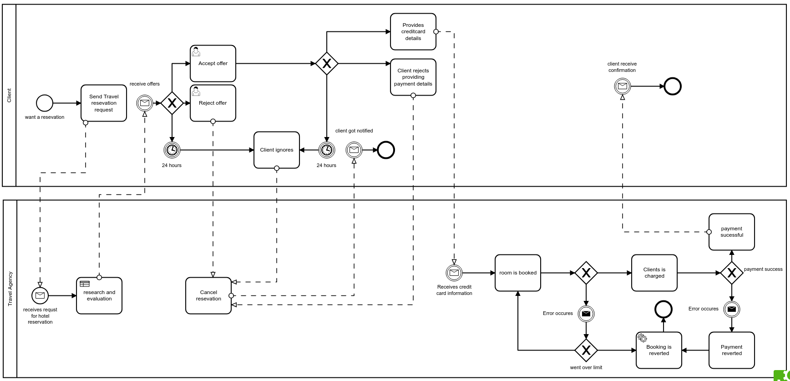

## SI Homework assignment BPMN

- Modelled scenario: [Hotel agency](https://github.com/datsoftlyngby/soft2019fall-si/blob/master/docs/Sessions/Week40/Assignments/Travel%20Booking%20H.pdf)

The process starts by a client sending a reservation request to the travel agency. The agency researches and evaluates pottential offers, using its business rules(shown as a business rule task) and returns them to the client. The client has 24 hours to accept or reject the offer(both human tasks). If an offer is accepted, then the the client enters credit card details and sends them back to the agency. If the client rejects, or 24 hours pass without any response, the agency cancels the reservation and notifies the client, ending the flow. As soon as the payment is received by the agency, the room is considered booked and the agecny proceeds to charge the clients credit card and send a confirmation to the client. If either the room booking fails, it is retried. If the it fails more times than the set limit, or there is a problem charging the credit card, both actions are reverted(represented as a service task).

